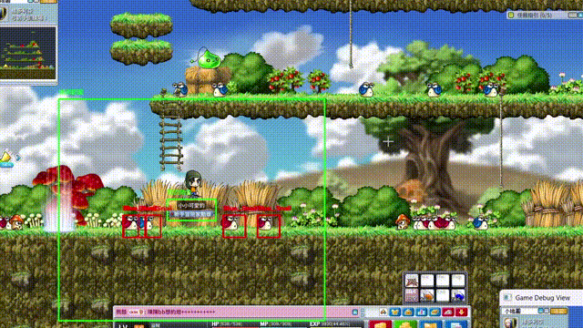
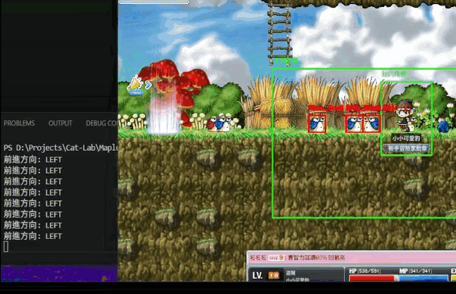
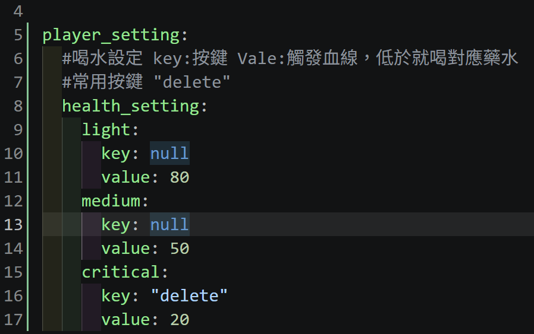
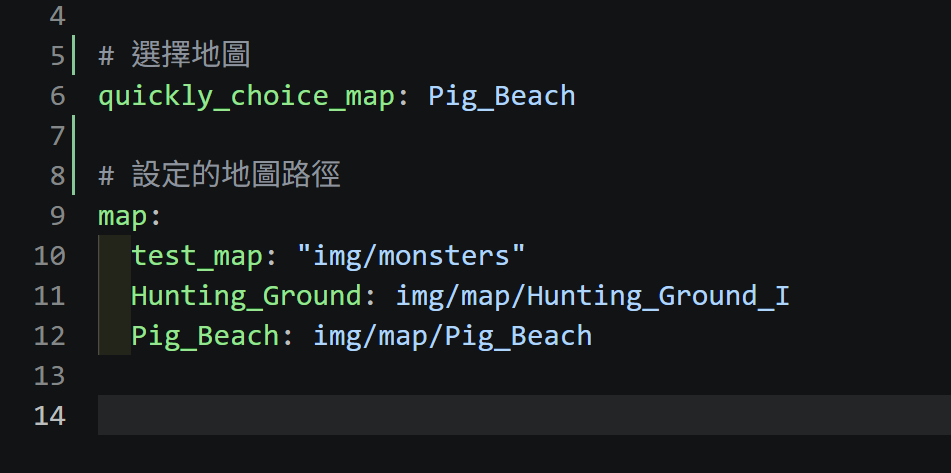

## For 楓之谷:經典版
---
## 小工具
| 檔案名稱 | 核心用途 | 目前狀態 | 備註 |
| :--- | :--- | :---: | :--- |
| `auto_pick_up.bat` | 自動撿拾腳本 | V 正常 | 另外寫的自動拾取腳本 |
| `Run_GetNametag.bat` | 擷取人物名牌 | V 正常 | 要先用這個抓自己人物名牌，才可以更準的定位 |
| `CaptureScreen.py` | 顯示座標與截圖 | V 正常 | 測算像素用 |

### Img Logging

  

  

---

## Dev Notes & TODO
>[TODO] 尋怪機制優化:研究了切片、MASK，但會加大運算量，以及NMS沒寫好的話，locs數量會非常多，若要劃出BBox更會造成運算量太大而CTD

>[TODO -> DONE]把撿拾功能寫入專案

>[TODO -> DONE]解決地圖邊界判定問題；用視窗擷取視窗中心回正；或是測算小地圖座標在還原，要再思考 －> 目前方法:ROI未偵測到人物後，會開始計數，達到設定閥值後，觸發隨機走路，讓人物偵測捕獲

>[TODO]尋怪邏輯:要再想想怎麼架構與行為邏輯 －> 目前是使用左右移動搭配隨機參數水平找怪

---

## Tech Stack

* **視窗抓取 (Win32 API + Pillow)**：
  * 使用 `win32gui` 取得遊戲視窗句柄 (`hwnd`) 與視窗邊界 (`GetClientRect` / `ClientToScreen`)。
  * 結合 `ImageGrab` (mss/Pillow) 進行高效能的視窗截圖，並轉為 OpenCV 的 BGR 陣列格式。
* **樣板匹配 (Template Matching)**：
  * **灰階與二值化預處理**：將畫面與模板轉為灰階，利用 `cv2.threshold` (OTSU 演算法) 消除雜訊、突顯輪廓。
  * **切片匹配 (Splitted Template Matching)**：
    * 將模板圖片進行寬度切片（`split_width`），分別與遊戲畫面進行比對，。
    * 支援使用遮罩（Mask）過濾背景干擾。
  * **歸一化相關係數 / 平方差匹配 (`cv2.matchTemplate`)**：
    * 選用 `cv2.minMaxLoc` 尋找最佳匹配點（最高相似度或最小差異值），並設定閾值（Threshold）過濾錯誤結果。
  * **NMS（Non-Maximum Suppression**
    * 利用NMS清除重複匹配，減輕`draw_dectection_box`繪圖運算量，打怪功能前的重要步驟
* **硬體操控**
    * 選用 `interception`，硬體層下達底層指令
    * 選用`keyboard`，實現綁定熟鍵
* **線程池**
    * 使用`concurrent.futures`內的`ThreadPoolExecutor`來分擔怪物模板匹配的工作
##

### Current Features (WIP)

* 自動尋怪
  * 螢幕視窗為中心的尋怪
* 自動打怪
* 自動撿東西
  * 簡易版，而且還要外掛使用...
* 自動喝水
  * 只有HP

### Setting

* 藥水設定
  * 路徑`./config/config_default`

  

* 地圖設定
  * 路徑`./config/config_data`
  * `quickly_choice_map`的值，設下列`map`的`value`
  * `map`下方的鍵值可以製作對應地圖的怪物配對模板

  

