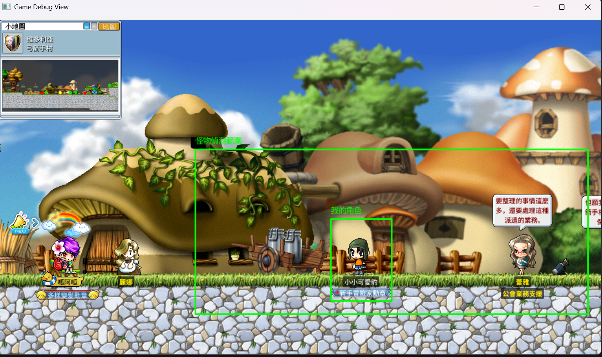

For 楓之谷:經典版
---
## 小工具
1. `open auto_pick_up in Admit.bat`: 遊戲內自動撿拾工具，`F2`啟動/關係，`F3`退出`。
2. `get_nametag.py`:擷取角色名稱圖片。
3. `CaptureScreen.py`:顯示座標系與截圖功能，方便測算像素。
## 進度

1. **遊戲視窗自動對齊**：透過 Win32 API 抓取指定遊戲視窗，自動將其置頂並取得座標範圍。
2. **角色動態名牌擷取 (`get_nametag.py`)**：
   * 透過已去背模版圖（example）配合遮罩搜尋角色。
   * 畫面即時預覽，按下 **`z`** 鍵可直接截取當前角色名牌並存檔，按下 **`q`** 鍵退出。
   * 取得的名牌作為(`GameBot.py`)搜索模板
3. **即時畫面追蹤與定位 (`GameBot.py`)**：
   * 全螢幕迴圈掃描遊戲畫面。
   * 即時計算角色中心點座標，以中心座標並裁切ROI範圍與繪製偵測框。
   * 內建錯誤日誌記錄（`logs/game_debug.log`）。
   * 設計先全圖搜索後取得角色中心點，在用ROI搜索，減少效能負擔
4. **怪物偵測雛形 (`MobHunting.py`)**：
   * 讀取 `img/monsters/` 底下的怪物模板，轉灰階後存進字典。
   * 在 ROI 範圍內用 `cv2.matchTemplate` 逐一比對模板，找到後回傳邊界框給 `GameBot.py` 畫框。

### 目前畫面（2026/08）

角色框（綠色）與 ROI 怪物偵測範圍（綠色框）已經能穩定跟隨角色，接下來重點會放在怪物偵測本身的準確度。

---

## 🐛 待解決問題 / TODO

### 1. ROI 邏輯還沒抓穩
- `_scan_local_area()` 裡的偏移量（`x_offset, y_offset = 300,250`）跟 `bottom` 算式裡莫名其妙的 `-250` 是憑感覺調出來的，不同地圖 / 不同角色縮放下範圍會跑掉，需要重新設計成可設定、可驗證的算法（或至少搬進 config）。
- ROI 掉幀後靠 `dectect_False_count > 10` 次才重置成全圖掃描，這個閾值也是隨手訂的，要觀察實際掉幀情境再調。

### 2. 怪物匹配度不夠
- `MobHunting.py` 目前用單一灰階模板 + `TM_CCOEFF_NORMED`，`MIN_THRESHOLD = 0.6`，怪物有動畫幀、被角色特效或站位遮擋時很容易匹配不到。
- 之後考慮：多幀模板（一隻怪存多張圖）、遮罩處理、或改用邊緣/二值化前處理增加穩定度（`common.py` 裡已經有 `BGR2Binary` 可以參考角色偵測的做法）。
- `MAX_THRESHOLD` / `MIN_THRESHOLD` 這兩個變數命名反了（`MAX` 比 `MIN` 小），純參數調整前記得先理清楚哪個是角色用、哪個是怪物用，不要調錯。

### 3. 多隻怪只顯示一隻
- `searching_mob()` 現在**一比對到就直接 `return`**，等於整個函式只回傳「第一個匹配到的模板 + 第一個匹配到的座標點」，畫面上同時有多隻怪也只會畫出一個框。
- 要改成：`np.where` 找到的 `loc` 全部跑完（目前迴圈裡有一個多餘的 `return None` 卡在 `for pt in loc` 裡面，導致連同模板的其他匹配點也被中斷），再考慮用 NMS（Non-Maximum Suppression）去掉同一隻怪身上重疊的多個框。
- `GameBot.py` 這邊的 `Mobdector()` 目前設計也只接得住「一組座標」，等 `searching_mob` 改成回傳 list 之後，這邊要跟著改成迴圈畫多個框。

### 已修正（08/05）
- `searching_mob()` 找不到怪時曾回傳 `(None, None)`，但 `GameBot.py` 用 `if not mob_result:` 判斷——`(None, None)` 是非空 tuple 所以判斷為真值，導致解包出 `None` 丟進 `draw_dectection_box` 直接炸掉。已改成統一回傳 `None` 並用 `is None` 判斷。這個順便也提醒自己：**tuple 只要有元素就是 truthy，就算元素本身是 None 也一樣**，以後判斷「有沒有結果」要用 `is None`，不要偷懶用 `not`。

---

## Tech Stack 

* **視窗抓取 (Win32 API + Pillow)**：
  * 使用 `win32gui` 取得遊戲視窗句柄 (`hwnd`) 與視窗邊界 (`GetClientRect` / `ClientToScreen`)。
  * 結合 `ImageGrab` (mss/Pillow) 進行高效能的視窗截圖，並轉為 OpenCV 的 BGR 陣列格式。
* **樣板匹配 (Template Matching)**：
  * **灰階與二值化預處理**：將畫面與模板轉為灰階，利用 `cv2.threshold` (OTSU 演算法) 消除雜訊、突顯輪廓。
  * **切片匹配 (Splitted Template Matching)**：
    * 將模板圖片進行寬度切片（`split_width`），分別與遊戲畫面進行比對。
    * 支援使用遮罩（Mask）過濾背景干擾。
  * **歸一化相關係數 / 平方差匹配 (`cv2.matchTemplate`)**：
    * 利用 `cv2.minMaxLoc` 尋找最佳匹配點（最高相似度或最小差異值），並設定閾值（Threshold）過濾錯誤結果。
* **硬體操控**
    * 使用 `interception`，對機械層下操作指令
    * 使用`keyboard`，實現綁定熟鍵