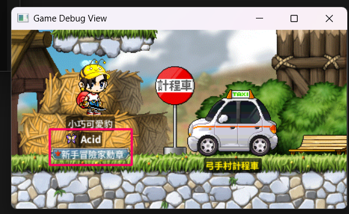
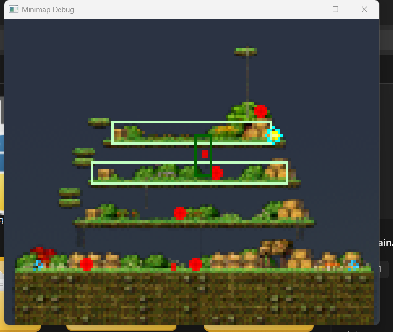
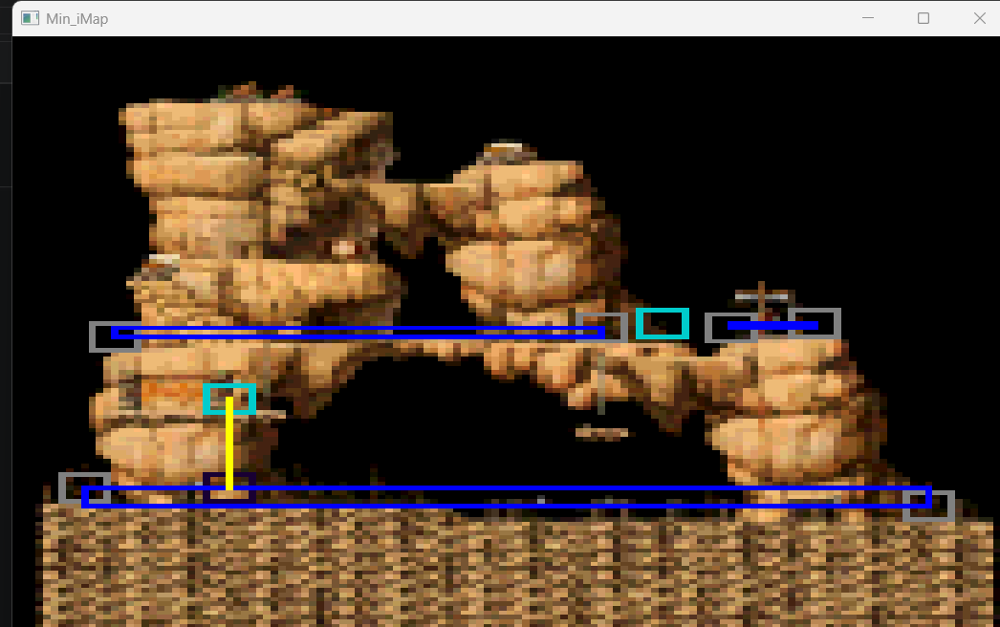
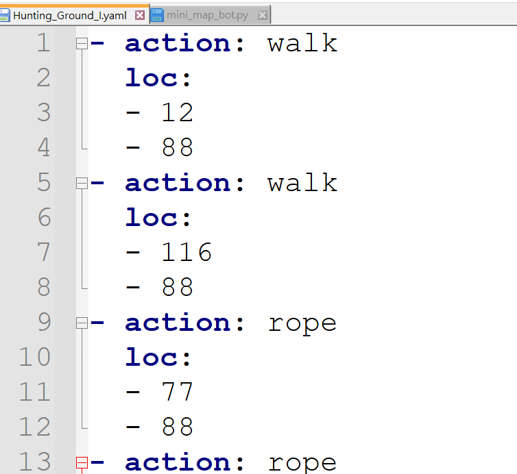
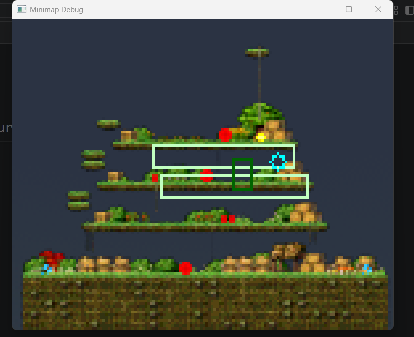

## For 楓之谷:經典版
---
<table>
  <tr>
    <td align="center">
      
    </td>
    <td align="center">
      
    </td>
  </tr>
</table>

>**Disclaimer**
>
> 本專案僅供個人學習 Python 影像辨識與自動化測試交流使用<br>請在合乎遊戲條例下使用。
---
---

##  Current Features (WIP)

| 功能項目 | 說明 |
| :--- | :--- |
| **自動移動** | 支援平台內移動與繩子上下移動 |
| **自動尋怪** | 依據平台左右邊界極值進行來回巡邏 |
| **自動打怪** | 可設定武器攻擊距離<br>支持鏢賊跳射 |
| **自動撿取** | 移動時自動觸發撿拾按鍵 |
| **自動喝水** | 喝紅藥水<br>喝藍藥水 |
| **卡住脫離**| 找最近平台返回<br>一定時間沒移動，觸發隨機走跳|

---
### 開發/測試環境
* 螢幕解析度（原生）：2560 x 1600
* DPI 縮放比例：125%
* 若環境與設置不同，可能造成偵測抓取低效或抓取不到範圍的問題。
---

## Usage
#### I. 安裝環境與套件
```bash
pip install -r requirements.txt
```
#### II. 製作角色名片: 
* 進入遊戲，開啟`GetNameTag.py`，找個視野乾淨的場景，按`Z`快照自己的角色名片，用作樣本匹配。

<p align="center">
  
</p>

#### III. 錄製移動路徑:
* 先到路徑`./config/config_data`
   設定`quickly_choice_map`的對應地圖。
* 進入遊戲，開啟`OperationLogger.py`，錄製`平台點`與`垂直移動的通道`
<p align="center">
  <br>
  <em >小地圖可以看見所畫的通道</em>
</p>

#### IV. 啟動程序:
* 確認角色已經在對應的遊戲地圖，打開`main.py`，運行程序。
* 預設按鍵`F9`:暫停；`F12`:關閉程序

---


## Setting

* 藥水設定
  * 路徑`./config/config_default`
<p align="center">
  
</p>

* 地圖設定
  * 路徑`./config/config_data`
  * `quickly_choice_map`的值，設下列`map`的`value`
  * `map`下方的鍵值可以製作對應地圖的怪物配對模板

<p align="center">
  
</p>

* Minimap 移動點設定
   * 路徑`
   ./img/mini_map/[對應的地圖]/[對應的地圖].yaml`
   * 要新增地圖模板到 `maplestory.wiki` 個網站抓
 

<table>
  <tr>
    <td align="center">
      <br>
    <em>錄製腳本繪製的路線</em>
    </td>
    <td align="center">
      <br>
      <em>路徑儲存的形式</em>
    </td>
  </tr>
</table>

* 路徑錄製方法
  * 放在跟目錄的腳本`OperationLogger.py`，能錄製路徑
  * 但是目前只完成`Walk`、`Rope`、`JumpRight`、`JumpLeft`行為點。


| 熱鍵    | 功能說明 | 備註 |
| :--- | :--- | :--- |
| &nbsp; **F1** | 儲存行為座標至 YAML | 將目前記錄的所有動作輸出為設定檔 |
| &nbsp; **F2** | 離開程式 | 安全關閉並退出 |
| &nbsp; **F4** | 紀錄點位：`Walk` | 記錄一般移動點 |
| &nbsp; **F5** | 紀錄點位：`Rope` | 記錄垂直爬繩點 |
| &nbsp; **F6** | 紀錄點位：`JumpRight` | 記錄向右跳躍點 |
| &nbsp; **F7** | 紀錄點位：`JumpLeft` | 記錄向左跳躍點 |
| &nbsp; **F8** | 紀錄點位：`JumpDown` | 記錄向下跳躍點 |

---

## Dev Notes 
>[LEARNING] 圖像匹配:為了提高精度，有測試切片、遮罩還有很多方法，但會貌似都很容易加大運算量，精度、效能也沒明顯提升，最後用線程池去做反而更簡單；測試時沒有添加過濾算法，locs數量會異常多，而劃出BBox可能因運算量太大而CTD

>[NOTE] 自動控制順序: 健康判定 -> 打怪判定 -> 平台巡邏找怪 -> 時間未找到怪物 -> 脫困判斷 -> 平台找垂直通道 -> 移動到下個平台 <br> 脫困判斷 1.不再平台或繩子上，判斷最近平台，並移動至最近平台

>[NOTE] 遊戲像素偏位: 每次遊戲重啟，都會有 X:0~2 Y:0~2的像素偏位。沒想到其他方法，目前只能把很多判定放寬取容錯

>[DONE]解決地圖邊界判定問題:舊版本ROI未偵測到人物後，會開始計數，達到設定閥值後，觸發隨機走路，讓人物偵測捕獲；改以小地圖+座標平台化，做左右邊界判定

>[TODO -> DONE ] 尋怪邏輯:改以minimap獲得的人物座標做計算，效果比原本的隨機找怪邏輯更好，不用浪費大量運算做人物座標抓取了。

>[TODO -> WIP] X,Y軸移動:Y軸移動還需要優化

>[ISSUE -> FIX] 健康監測:畫面不匹配，導致抓不到像素，原本的防呆功能好像沒有用處，尤其是畫面切換時，會一直觸發喝水行為;觀察原因，健康條會閃爍，閃爍時抓取的數值為0，導致觸發喝水；修正方式:更改異常判定、加血魔冷卻計算。

>[ISSUE -> FIX] 健康模組:把HP偵測範圍寫死，導致若畫面DPI縮放，偵測範圍會跑掉；修正後，改模板匹配初始化座標。 

>[TODO - DONE] 卡死走回: 超出範圍，走回最近平台，不過Y值差距太大沒用

>[ISSUE -> FIX] 小地圖偏位:openCV做的小地圖，與實際地圖沒辦法對齊，模組都排查了，但還是想不出為什麼會這樣，希望不要是DPI影響的問題；找出問題原因，MinimapDetector模組中，cv2.findNonZero找出所有顏色座標後，被取平均，導致座標點異常，改以cv2.findContours搭配cv2.RETR_EXTERNAL與cv2.CHAIN_APPROX_SIMPLE 只抓單一最大輪廓。

>[TODO] 模板匹配優化:用支援MASK遮罩的匹配法，把目前的匹配方法換掉

>[TODO] 行為點:增加更多種行為點，右邊跳躍、左邊跳躍、下跳之類的，放在預設的狀態機"PathfindState"類

<p align="center">
  
  <br>
  <em>cv2畫出的BBOX與原版地圖不合(已修復))</em>
</p>

>[ISSUE] AutoControl臃腫: 用了大量的Flag、IF判斷去控制邏輯，方向不大對，非常難維護。應該要在想個方法重構這塊。
---

## Tools
| 檔案名稱 | 核心用途 | 備註 |
| :--- | :--- |  :--- |
| `Auto_PickUP.py` | 自動撿拾腳本 |  拾取腳本，當有觸發"方向鍵"的"上下左右"時，會自動觸發撿拾按鍵 |
| `GetNameTag.py` | 擷取人物名牌 |  要先用這個抓自己人物名牌，才可以更準的定位。啟動後找到乾淨的背景按下"Z"鍵，提取人物名牌。 |
| `CaptureScreen.py` | 顯示座標與截圖 |  計算螢幕座標與視窗內座標  |
|`OperationLogger.py`|錄製小地圖的行動點|沒有錄製行動點的話，程序沒辦法動，至少錄製一個打怪平台，才可以計算左右範圍，儲存路徑為 `mini_map\[對應地圖]`的目錄下，錄製前要在`config_data.yaml`設定`quickly_choice_map`|

---
## Tech Stack

* **視窗抓取 (Win32 API + Pillow)**：
  * 使用 `win32gui` 取得遊戲視窗句柄 (`hwnd`) 與視窗邊界 (`GetClientRect` / `ClientToScreen`)。
  * 結合 `ImageGrab` (mss/Pillow) 進行高效能的視窗截圖，並轉為 OpenCV 的 BGR 陣列格式。
* **樣板匹配 (Template Matching)**：
  * **灰階與二值化預處理**：將畫面與模板轉為灰階，利用 `cv2.threshold` (OTSU 演算法) 消除雜訊、突顯輪廓。
  * `TM_CCORR_NORMED`:支援使用遮罩（Mask）過濾背景干擾。
  * `TM_CCOEFF_NORMED` :基礎匹配方法。
  * **NMS（Non-Maximum Suppression**
    * 利用NMS清除重複匹配，減輕`draw_dectection_box`繪圖運算量，打怪功能前的重要步驟

* **硬體操控**
    * 選用 `interception`: 硬體層下達底層指令，能繞過多遊戲的封鎖
    * 選用`keyboard`: 最簡單、最直觀，也功能強大，但是是信息層命令，所以很多命令控制不太穩
    * 使用`win32gui` : Windows API 底層是 原生的微軟 C+ 所以很好用，就是寫法不親民
* **線程池**
    * 使用`concurrent.futures`內的`ThreadPoolExecutor`來分擔怪物模板匹配的工作
##


